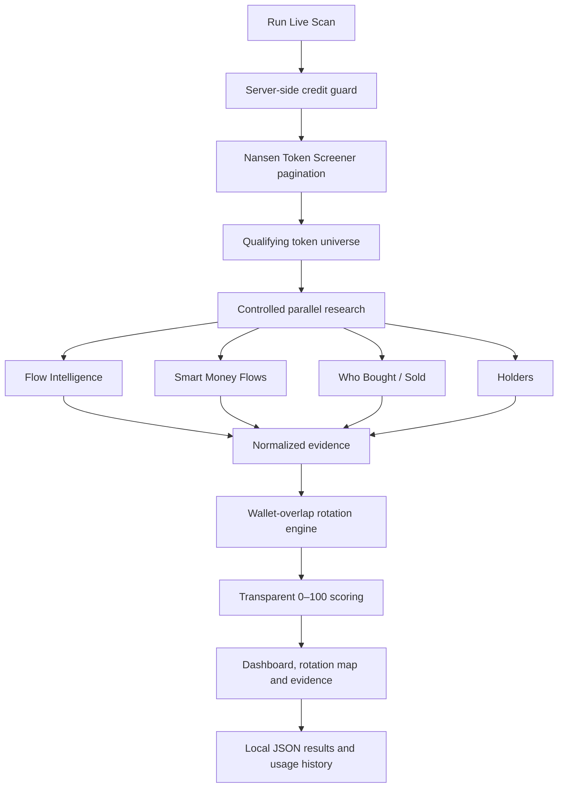

# Nansen Smart Money Rotation Radar

> See where Smart Money is buying & appears to be rotating before the crowd.

Yup you not only see where smart money is buying but also their next buy, now that's one smart radar

An autonomous multi-chain research application built entirely on the Nansen API. It discovers qualifying tokens, researches real Smart Money buyers and sellers, detects cross-token wallet overlap, and ranks probable rotation destinations with transparent evidence.

It does **not** claim that funds moved directly from Token A to Token B. A rotation is an evidence-based inference: the same wallet was observed selling A and buying B during the research window.

## Demo

[▶ Watch the 54-second product demo](demo/nansen-smart-money-radar-demo.mp4)

Normal use is intentionally simple:

```text
Double-click Start Radar.bat → browser opens → choose 10–200 credits → Run Live Scan
```

The dashboard also includes a separate **Live Scan 2 Campaign** for the [buildathon's 1,000-call requirement](https://nansen.ai/campaigns/meridian-buildathon#submit). One run can send up to 909 genuine Nansen API calls behind a hard send-site guard that makes request 910 impossible, broadens wallet research across a staged token universe, records real cross-token overlaps, and enforces a 15-minute cooldown between runs.

## What the project answers

Most screeners answer “which token is moving?” Rotation Radar asks a different question:

> Which tokens are attracting wallets that Nansen also observed selling other tokens?

The answer combines token discovery, wallet-level behavior, flow context, holder structure, liquidity, and explainable scoring in one dashboard.

## System architecture



## Research pipeline

### 1. Automatic discovery

The application calls the official [Nansen Token Screener](https://docs.nansen.ai/api/token-god-mode/token-screener) across Ethereum, Base, Solana, BNB Chain, and Arbitrum.

Current discovery filters:

- Smart Money trader activity
- stablecoins excluded
- market cap: $1 million–$1 billion
- liquidity: at least $100,000
- volume: at least $100,000
- positive netflow: at least $1,000
- at least three qualifying traders
- ranked by netflow

There is **no fixed token-count ceiling**. Discovery requests 20 records per documented page and continues until Nansen reports the last page, returns no new tokens, or the selected credit budget blocks another live request. Zero tokens is a valid result; the application never invents candidates or weakens filters to fill a quota.

### 2. Wallet-level research

Each token selected within the remaining budget is researched using:

- [Flow Intelligence](https://docs.nansen.ai/api/token-god-mode/flow-intelligence) for Smart Trader netflow and wallet counts
- [Flows](https://docs.nansen.ai/api/token-god-mode/flows) for recent Smart Money flow history
- [Who Bought/Sold](https://docs.nansen.ai/api/token-god-mode/who-bought-sold) twice—BUY and SELL—for wallet-level behavior
- [Holders](https://docs.nansen.ai/api/token-god-mode/holders) for concentration and balance-change evidence

Research runs in controlled parallel across tokens. One failed token does not crash the complete scan.

### 3. Probable rotation detection

For every researched token pair, the engine compares:

```text
seller wallets for TOKEN_A ∩ buyer wallets for TOKEN_B
```

One or more matching wallet addresses creates a `PROBABLE_SMART_MONEY_ROTATION` edge. The evidence preserves wallet address, label, observed source selling volume, observed destination buying volume, destination netflow, and an explainable confidence score.

### 4. Explainable scoring

Every destination receives a bounded 0–100 score:

| Component | Maximum |
| --- | ---: |
| Smart Money netflow | 25 |
| Smart Buyer conviction | 20 |
| Rotation confirmation | 25 |
| Market quality / liquidity | 15 |
| Holder quality | 15 |

Penalties cover heavy selling, weak liquidity, and dangerous holder concentration. Output states are `ROTATION_IN`, `EARLY_ACCUMULATION`, `WATCH`, `NEUTRAL`, `DISTRIBUTION`, and `HIGH_RISK`—never BUY or SELL.

The complete methodology and formulas are documented in [METHODOLOGY.md](docs/METHODOLOGY.md).

## Credit safety and pagination

The dashboard accepts a whole-number budget from **10 through 200 credits**, defaulting to 200. The backend independently validates the submitted budget and enforces the cap before every live request; changing the browser cannot bypass it.

The application uses deliberately conservative accounting:

| Request | Reserved credits |
| --- | ---: |
| Token Screener page | 10 |
| Flow Intelligence | 10 |
| Flows | 10 |
| Who Bought/Sold BUY | 10 |
| Who Bought/Sold SELL | 10 |
| Holders | 50 |
| Full research for one token | 90 |

Examples:

- **10 credits:** one discovery page, zero researched tokens
- **100 credits:** one discovery page plus one fully researched token when no second discovery page or retry is needed
- **200 credits:** commonly one discovery page plus two researched tokens (190 reserved); extra pages or retries can reduce that number

The scanner starts a research batch only when the conservative budget can fund complete 90-credit token research. HTTP 429 retries are separately budgeted, bounded, and respect `Retry-After`. The hard cap is never exceeded.

## 1,000-call Live Scan 2 Campaign

The buildathon campaign mode is meaningful research—not an API-call generator. One uncached run sends up to **909 genuine Nansen API calls** (the campaign's 875-credit ceiling and 5-credit safety reserve always keep the account above zero) through a staged planner:

```text
Stage CORE      — 7d BUY/SELL wallet research, 1d Flow Intelligence,
                  7d Flows for every discovered token
Stage EXTENDED  — 30d and 90d BUY/SELL windows and 30d Flows (distinct
                  date ranges, same proven request shapes)
Stage HOLDERS   — paged holder research
+ iterative Token Screener discovery and lazy deep-page continuation
  (a next page is requested only while Nansen returns a full page)
= up to 909 genuine, distinct Nansen calls per run
```

Every actual HTTP request to Nansen—including each 429 retry—is counted against the 909 budget by a send-site guard, so request 910 can never leave the process. Cache hits, skipped tasks, and requests refused before transmission never consume the budget. The dashboard reports live progress as `Nansen API calls: N/909`, and the completion report lists calls sent, successful, failed, retries, budget remaining, and the reason a run stopped short of 909 (usually "no further distinct research requests were available").

Safety rules:

- a hard global cap of 909 real requests per run, enforced at the send site
- the campaign credit guard uses Nansen's real per-request costs (1 credit for screener/who-bought-sold/flow-intelligence/flows, 5 for holders) under an 875-credit ceiling, so at least 4 of 879 credits stay unused
- fatal aborts on configuration/authentication/plan/credit errors, and stop-after-10 streaks for transport or rate-limit failures
- a 15-minute cooldown prevents duplicate snapshots inside the cache window
- cache hits do not count toward the target
- a new token, window, or page is requested only when it adds distinct evidence; the run stops early with an explicit reason rather than repeating identical requests
- the campaign stops accepting runs when the genuine counter reaches 1,000
- the user must start each cycle; the app never spends credits unattended

## Dashboard evidence

The browser dashboard shows:

- every token discovered during the scan
- analyzed versus budget-skipped status
- contract, chain, market cap, liquidity, and netflow
- Smart Money buyer and seller counts
- 0–100 score and evidence state
- probable directional rotation edges
- overlapping wallet evidence and labels
- current and cumulative genuine Nansen calls
- credits reserved, duration, failures, cache hits, and latency

If no wallet overlap exists, the rotation map shows a truthful zero-rotation state rather than fake evidence.

## One-click Windows start

### Requirements

- Windows
- Node.js 20 or newer
- a Nansen API key with sufficient credits

### Setup

1. Clone or download this repository.
2. Copy `.env.example` to `.env`.
3. Add your key: `NANSEN_API_KEY=your_key_here`.
4. Double-click `Start Radar.bat`.
5. Choose a credit cap and click **Run Live Scan**.

The launcher checks Node/npm, installs dependencies when missing, starts both servers, waits for readiness, and opens `http://127.0.0.1:5173` automatically. It avoids launching duplicate project servers.

For development:

```bash
npm install
npm run dev
```

## API routes

| Method | Route | Purpose |
| --- | --- | --- |
| GET | `/api/health` | Service readiness |
| POST | `/api/scan` | Start a live scan with `{ "creditLimit": 200 }` |
| GET | `/api/status` | Current scan phase and message |
| GET | `/api/results` | Latest completed scan |
| GET | `/api/rotations` | Latest rotation edges |
| GET | `/api/usage` | Genuine Nansen call history |
| GET | `/api/history` | Summarized scan history |
| POST | `/api/campaign` | Run one credit-capped Live Scan 2 campaign cycle |
| GET | `/api/campaign` | Read 1,000-call progress, cooldown and latest campaign evidence |

## Reliability and privacy

- The Nansen key remains server-side and is never sent to React.
- `.env`, cached responses, scan results, history, and API usage files are excluded from Git.
- The public repository contains `.env.example` only; it contains no secret.
- Runtime results persist locally, so reopening the launcher restores the last successful scan.
- The 15-minute JSON cache prevents repeated identical live requests; cache hits do not increment the live-call counter.
- Bounded exponential backoff handles HTTP 429 responses.
- All runtime timing and usage figures come from real execution—there are no mock dashboard results.

## Verification

```bash
npm test
npm run build
```

Current release status:

- 32 automated tests passing
- production build passing
- npm production dependency audit: zero known vulnerabilities at release time
- one-click launcher verified locally
- live Nansen discovery and wallet-level buyer/seller gates verified during development

See [JUDGING_GUIDE.md](docs/JUDGING_GUIDE.md) for a fast feature-to-evidence map and [DEMO_SCRIPT.md](DEMO_SCRIPT.md) for the 30–60 second walkthrough.

## Limitations

- Wallet overlap is behavioral evidence, not proof of a direct asset transfer.
- Results depend on current Nansen coverage, plan access, latency, and credits.
- A small credit budget may discover tokens without leaving enough budget to research them.
- The scoring model is transparent and deterministic but has not been validated as an investment strategy through long-horizon backtesting.
- This is a research tool, not financial advice or an automated trading system.

## Technology

Node.js · Express · React 19 · Vite · plain JavaScript · local JSON persistence
